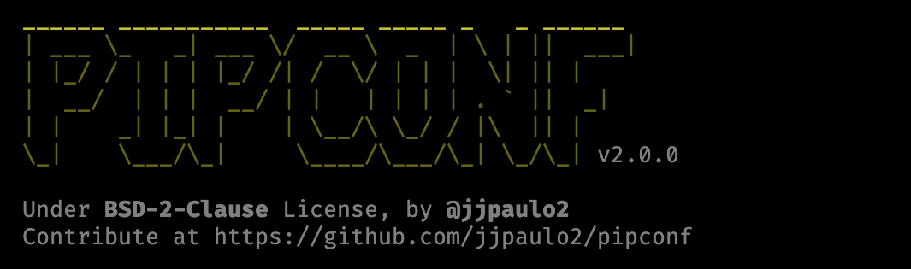

# PIPCONF - The PIP configuration manager


[](https://github.com/jjpaulo2/pipconf/actions/workflows/tests.yaml)
[](https://github.com/jjpaulo2/pipconf/actions/workflows/publish.yaml)
[](https://pypi.org/project/pipconf/)
[](https://github.com/sponsors/jjpaulo2)



If you need to manage multiple configurations containing indexes and trusted hosts for PIP, this project was made for you.

- [Introduction](#introduction)
- [Installation](#instalation)
- [Usage](#usage)
    - [List all available configurations](#list-all-available-configurations)
    - [Create a new configuration](#create-a-new-configuration)
    - [Get current configuration](#get-current-configuration)
    - [Show the configuration file content](#show-the-configuration-file-content)
    - [Set configuration file](#set-configuration-file)
    - [Set local file as the current config](#set-local-file-as-the-current-config)


### Introduction

The `pipconf` is based in `pip.conf` files in `$HOME/.pip` folder. But you won't create it with this name. So, you need to create your configuration files following the template `config-file-name.conf`. 

For the first steps, create a new configuration.

```shell
$ pipconf new my-config.conf --open
```

The file will come with a configuration template. All you need to do is just replace with your necessities.

```toml
<!-- my-config.conf -->

[global]
index-url = https://pypi.org/simple
# extra-index-url = 
# trusted-host = 
# timeout = 15
# retries = 5
...
```

```toml
<!-- company-config.conf -->

[global]
index-url = http://mycompany.com/artifactory/api/pypi/pypi/simple
extra-index-url = http://mycompany.com/artifactory/api/pypi/pypi-local/simple/
trusted-host = mycompany.com
```

## Instalation

The package is available at [pypi.org](https://pypi.org/project/pipconf/). Then, you can install it using pip.

```shell
$ pip install pipconf
```

## Usage

```shell
$ pipconf --help
```
The expected output should be something like the following content.

```
 Usage: pipconf [OPTIONS] COMMAND [ARGS]...         
                                                    
 ______ ___________  _____ _____ _   _ ______       
 | ___ \_   _| ___ \/  __ \  _  | \ | ||  ___|      
 | |_/ / | | | |_/ /| /  \/ | | |  \| || |          
 |  __/  | | |  __/ | |   | | | | . ` ||  _|        
 | |    _| |_| |    | \__/\ \_/ / |\  || |          
 \_|    \___/\_|     \____/\___/\_| \_/\_| v2.0.0   
                                                    
 Under BSD-2-Clause License, by @jjpaulo2           
 Contribute at https://github.com/jjpaulo2/pipconf  
                                                    
╭─ Display informations ───────────────────────────╮
│ current   Shows the currently active config file │
│ list      Lists all available configs            │
│ show      Shows a config file content            │
╰──────────────────────────────────────────────────╯
╭─ Change configurations ──────────────────────────╮
│ local   Select a config file in current workdir  │
│ new     Creates a new config file                │
│ set     Select a configuration                   │
╰──────────────────────────────────────────────────╯
```

### List all available configurations

```shell
$ pipconf list
```
```
Available configurations at /home/user/.pip:

● company.conf (/home/user/.pip/company.conf)
○ my-config.conf (/home/user/.pip/my-config.conf)
○ project.conf (/home/user/.pip/project-config.conf)
```

### Create a new configuration

```shell
$ pipconf new my-config
```
```
Config file my-config.conf created!
```

You can also pass a `--open` flag to create and open the file.

```shell
$ pipconf new my-config --open
```

### Get current configuration

```shell
$ pipconf current
```
```
Current configuration is /home/user/.pip/my-conf.conf!
```

### Show the configuration file content

```shell
$ pipconf show my-conf
```
```
╭─────────── /home/user/.pip/test.conf ────────────╮
│ [global]                                         │
│ index-url = https://pypi.org/simple              │
│ ...                                              │
╰──────────────────────────────────────────────────╯
```

If you don't pass any parameter, the command will show the content of the current configation file.

```shell
$ pipconf show
```

### Set configuration file

```shell
$ pipconf set my-config
```
```
Configuration is now set to my-config.conf!
```

### Set local file as the current config

If in the current workdir exists a file named `pip.conf`, you can set it as the current configuration.

```shell
$ pipconf local
```
```
Configuration is now set to /home/user/workspace/project/pip.conf!
```

---

Under [BSD-2-Clause License](./LICENSE), by [@jjpaulo2](https://github.com/jjpaulo2).
